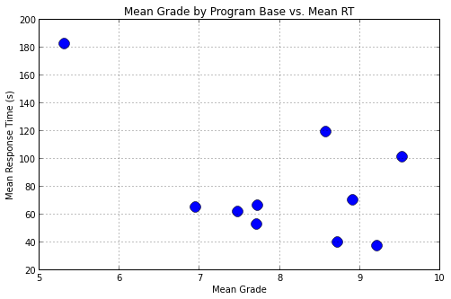
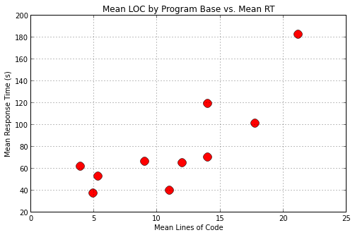

# eyeCode Response Data Analysis

Import libraries and data from xml.

```python
import pandas, statsmodels.api as sm
from lxml import etree
from response_stats import make_dataframe
from scipy import stats
```

```python
xml_experiments = etree.parse("data/response_data.xml.gz").xpath("//experiment")
trials = make_dataframe(xml_experiments)
trials
```


**Output**:

```
<class 'pandas.core.frame.DataFrame'>
Int64Index: 1602 entries, 0 to 1601
Data columns:
id                   1602  non-null values
exp_id               1602  non-null values
base                 1602  non-null values
version              1602  non-null values
grade_value          1602  non-null values
grade_category       1602  non-null values
started              1602  non-null values
ended                1602  non-null values
response_duration    1602  non-null values
py_years             1602  non-null values
prog_years           1602  non-null values
age                  1602  non-null values
degree               1602  non-null values
gender               1602  non-null values
location             1602  non-null values
code_lines           1602  non-null values
duration             1602  non-null values
response_percent     1602  non-null values
common               1602  non-null values
dtypes: bool(1), float64(5), int64(5), object(8)
```

Group all trials by program base type and compute the average grade, response time, and lines of code.

```python
data = trials[["base", "grade_value", "code_lines", "duration"]].groupby("base").mean()
data
```


**Output**:

```
            grade_value  code_lines    duration
base
between        5.314465   21.169811  182.238994
counting       7.478261    3.906832   61.627329
funcall        9.216049    4.962963   36.975309
initvar        7.725000    9.000000   66.012500
order          8.906832   14.000000   70.285714
overload       8.720497   11.000000   40.086957
partition      7.712500    5.343750   52.837500
rectangle      9.522013   17.735849  101.169811
scope          6.949686   12.000000   65.264151
whitespace     8.575000   14.000000  119.131250
```

The figure below shows that there is a slight negative correlation between grade and response time.

```python
pyplot.figure(figsize=(8, 5))
ax = data.plot(x="grade_value", y="duration", marker="o", markersize=12, linestyle="")
ax.set_title("Mean Grade by Program Base vs. Mean RT")
ax.set_xlabel("Mean Grade")
ax.set_ylabel("Mean Response Time (s)")
ax.grid()
```


**Output**:



This is quantified by a Pearson correlation. The correlation is moderate, but not statistically significant.

```python
r, p = stats.pearsonr(data.grade_value, data.duration)
print "Correlation between mean grade and response time: {0} (p={1})".format(r, p)
```


**Output**:

```
Correlation between mean grade and response time: -0.548014281692 (p=0.10100278136)
```

Another possibility is that the response time is driven by lines of code. A quick plot shows a strong positive correlation.

```python
pyplot.figure(figsize=(8, 5))
ax = data.plot(x="code_lines", y="duration", marker="o", markersize=12, linestyle="", color="red")
ax.set_title("Mean LOC by Program Base vs. Mean RT")
ax.set_xlabel("Mean Lines of Code")
ax.set_ylabel("Mean Response Time (s)")
ax.grid()
```


**Output**:



The stats agree.

```python
r, p = stats.pearsonr(data.code_lines, data.duration)
print "Correlation between LOC and response time: {0} (p={1})".format(r, p)
```


**Output**:

```
Correlation between LOC and response time: 0.813437462179 (p=0.00420323835287)
```

We can see if **both** grade and LOC are important by comparing two linears models: one with just LOC, and another with both predictors.

### Linear model with just LOC

```python
X = sm.add_constant(data["code_lines"], prepend=True)
y = data["duration"]
fit = sm.OLS(y, X).fit()
print fit.summary()
print ""
```


**Output**:

```
                            OLS Regression Results
==============================================================================
Dep. Variable:               duration   R-squared:                       0.662
Model:                            OLS   Adj. R-squared:                  0.619
Method:                 Least Squares   F-statistic:                     15.65
Date:                Tue, 14 May 2013   Prob (F-statistic):            0.00420
Time:                        22:20:19   Log-Likelihood:                -46.095
No. Observations:                  10   AIC:                             96.19
Df Residuals:                       8   BIC:                             96.80
Df Model:                           1
==============================================================================
                 coef    std err          t      P>|t|      [95.0% Conf. Int.]
------------------------------------------------------------------------------
const          8.1192     20.001      0.406      0.695       -38.004    54.242
code_lines     6.3158      1.597      3.956      0.004         2.634     9.998
==============================================================================
Omnibus:                        0.864   Durbin-Watson:                   1.176
Prob(Omnibus):                  0.649   Jarque-Bera (JB):                0.611
Skew:                           0.130   Prob(JB):                        0.737
Kurtosis:                       1.817   Cond. No.                         29.3
==============================================================================

```

### Linear model with both LOC and grade

```python
X = sm.add_constant(data[["grade_value", "code_lines"]], prepend=True)
y = data["duration"]
fit = sm.OLS(y, X).fit()
print fit.summary()
print ""
```


**Output**:

```
                            OLS Regression Results
==============================================================================
Dep. Variable:               duration   R-squared:                       0.796
Model:                            OLS   Adj. R-squared:                  0.737
Method:                 Least Squares   F-statistic:                     13.63
Date:                Tue, 14 May 2013   Prob (F-statistic):            0.00385
Time:                        22:13:07   Log-Likelihood:                -43.573
No. Observations:                  10   AIC:                             93.15
Df Residuals:                       7   BIC:                             94.05
Df Model:                           2
===============================================================================
                  coef    std err          t      P>|t|      [95.0% Conf. Int.]
-------------------------------------------------------------------------------
const         121.7400     55.565      2.191      0.065        -9.651   253.131
grade_value   -13.2049      6.162     -2.143      0.069       -27.776     1.366
code_lines      5.6242      1.365      4.120      0.004         2.396     8.852
==============================================================================
Omnibus:                        0.253   Durbin-Watson:                   1.986
Prob(Omnibus):                  0.881   Jarque-Bera (JB):                0.353
Skew:                          -0.278   Prob(JB):                        0.838
Kurtosis:                       2.267   Cond. No.                         114.
==============================================================================

```

The model with both predictors does better, both in terms of r-squared and AIC/BIC.

